# Embassy

## Prerequisites

### The Rust toolchain

In order to install the tools needed to compile Rust code, follow the next steps, depending on your operating system.

#### Linux

Run the this command in terminal:

```shell
curl --proto '=https' --tlsv1.2 -sSf https://sh.rustup.rs | sh
```

This downloads and runs `rustup-init.sh`, which in turn downloads and runs the correct version of the `rustup-init` executable for your platform.

#### Windows

Download the respective executable:

* [RUSTUP-INIT.exe - 64bit](https://static.rust-lang.org/rustup/dist/x86_64-pc-windows-msvc/rustup-init.exe)
* [RUSTUP-INIT.exe - 32bit](https://static.rust-lang.org/rustup/dist/i686-pc-windows-msvc/rustup-init.exe)

:::note
You may be prompted to install [Visual Studio C++ Build tools](https://visualstudio.microsoft.com/visual-cpp-build-tools/). If so, follow the instructions from the previous link.

Even if Visual Studio is already on your machine, `rustup` will not verify if the required components are present. If you experience issues with the `rustup` installation on Windows, please follow [these instructions](https://rust-lang.github.io/rustup/installation/windows-msvc.html#installing-only-the-required-components-optional) to manually add the missing components.
:::

The last step is to run `rustup --version` in terminal. If everything went well, you should see an output similar to this:

```shell
rustup 1.28.1 (f9edccde0 2025-03-05)
info: This is the version for the rustup toolchain manager, not the rustc compiler.
info: The currently active `rustc` version is `rustc 1.85.0 (4d91de4e4 2025-02-17)`
```

### `probe-rs`

`probe-rs` is an embedded debugging and target interaction toolkit. It enables its user to program and debug microcontrollers via a debug probe. To install it, please follow the [official installation tutorial](https://probe.rs/docs/getting-started/installation/).

If you are on **Linux** you will also need to add this [`udev`](https://probe.rs/files/69-probe-rs.rules) file in `/etc/udev/rules.d`. Then, run:

```shell
udevadm control --reload # to ensure the new rules are used.

udevadm trigger # to ensure the new rules are applied to already added devices.
```

## Hardware support overview

This is a top view of the board we will use for this workshop:

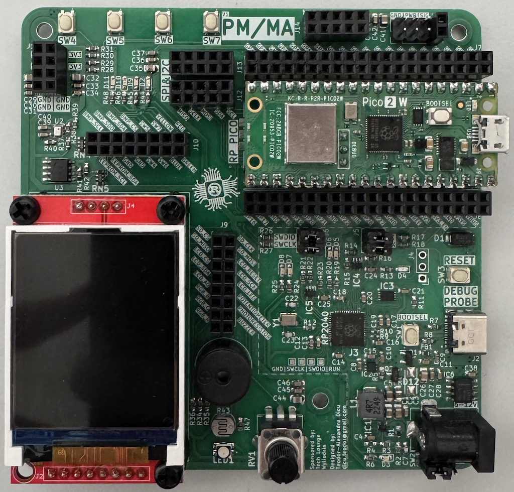

The schematics can be found [here](https://gitlab.cs.pub.ro/pmrust/pm-ma-pcb). Feel free to consult them!

### Raspberry Pi Pico 2 W

The *"brains"* of the board is represented by the **Raspberry Pi Pico 2 W**, a compact microcontroller with dual-core **Arm Cortex-M33** and optional dual-core **RISC-V Hazard3**, running at up to **150 MHz**. It features **520 KB SRAM**, **4 MB flash storage**, and built-in Wi-Fi (802.11n) & Bluetooth 5.2 via the **CYW43439** chip. It includes a 40-pin GPIO header with **26 digital I/O pins**, **4 analog inputs** and security enhancements include **Arm TrustZone** and **OTP memory**. This makes it ideal for IoT and embedded applications.

## Documentation

### GPIO

#### What is GPIO?

General-Purpose Input/Output, or GPIO, is an essential part of embedded systems that serves as a vital conduit between microcontrollers and microprocessors and the outside world. A microcontroller or microprocessor's group of pins that can each be set to operate as an input or an output is referred to as GPIO. The purpose of these pins is to interface external components, including actuators, displays, sensors, and other devices, so that the embedded system may communicate with its surroundings. Standardized communication protocols like SPI, I2C, PCM, PWM, and serial communication may be directly supported by some GPIO pins. There are two varieties of GPIO pins: digital and analog.

#### Configuring GPIO Pins

GPIO pins can be used as outputs (LEDs, motors, buzzers) or as inputs (buttons, sensors).

The RP2040 and RP2350 have three peripherals that control the GPIO pins:

1. *Pads* - control the actual physical pin or pad that the processor has outside. They control the electrical parameters, like maximum current or pull up and pull down resistors
2. *IO Bank0* - connects and multiplexes the peripheral's pins to the output pads. Several peripherals use the same output pad to communicate with the exterior. For example, in the image below, `GPIO0` can be used either for:
    * `SIO` - the `GPIO` function
    * `SPI_RX` - the receive pin for the `SPI` peripheral
    * `I2C0_SDA` - the data pin for the `I2C0` peripheral
    * `UART0_TX` - the transmit pin for the `UART0` (serial port 0) peripheral
3. *SIO* - that controls the interior MCU's pins. This is the peripheral that developers use to read and write the value of the pins.

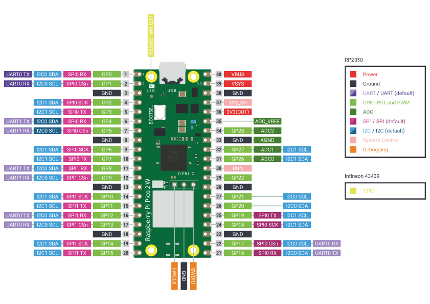

Every pin of the MCU can perform multiple functions. Several peripherals need to use input and output pins.
It is the role of the *IO Bank0* to multiplex and connect the peripherals to the pins.

<div align="center">
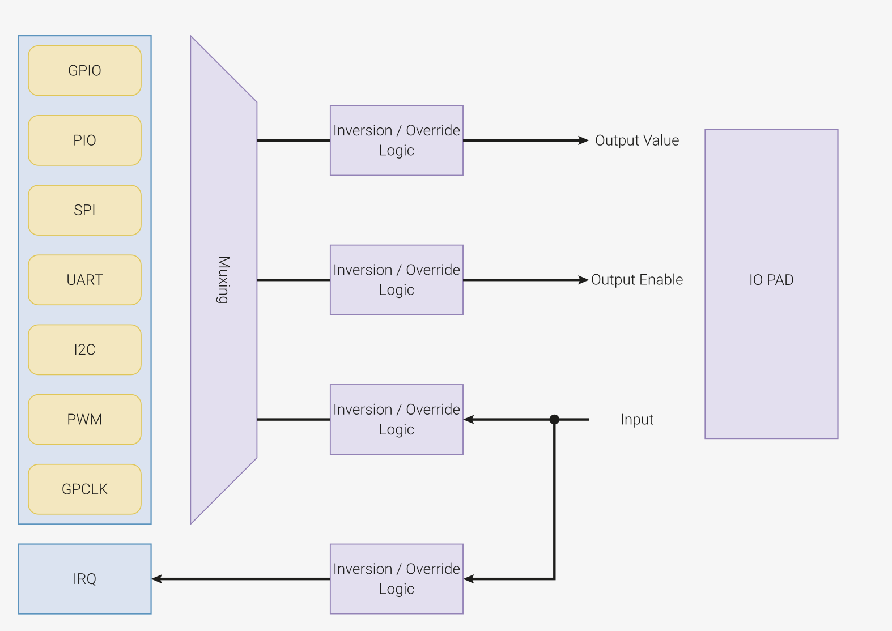
</div>

### Timing

In embedded applications, keeping track of time is crucial. Even for the simple task of blinking an LED at a certain time interval, we need a reference of time that is constant and precise.

#### Clocks

A clock is a piece of hardware that provides us with that reference. Its purpose is to oscillate at a fixed frequency and provide a signal that switches from high to low at a fixed interval.

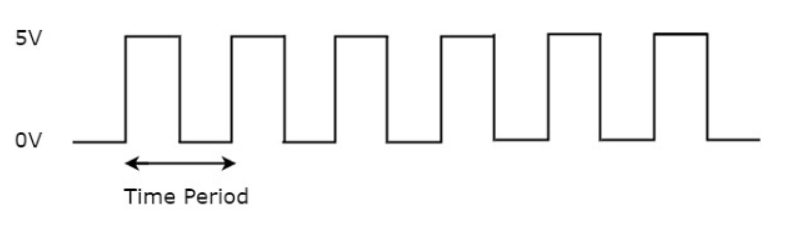

The most precise type of clock is the crystal oscillator (XOSC). The reason why it is so accurate is because it uses the crystal's natural vibration frequency to create the clock signal. This clock is usually external to the processor itself, but the processor also has an internal clock (ROSC) that is less accurate and that can be used in cases where small variations of clock pulses are negligible. When using the USB protocol, for instance, a more stable clock signal is required, therefore the XOSC is necessary. The crystal oscillator on the Raspberry Pi Pico board has a frequency of 12MHz.

This clock signal is just a reference, and most of the time we need to adjust it to our needs. This is done by either multiplying or dividing the clock, or in other words, elevating or lowering the frequency of the clock. For example, the RP2040 itself runs on a 133MHz clock, so the crystal oscillator frequency of 12MHz is multiplied (this is done using a method called Phase-Locked Loop). Similarly, the RP2350, the successor to the RP2040, also uses a PLL to adjust the 12MHz reference clock but supports a higher clock speed of 150MHz. This increased clock speed, along with more precise frequency control and improved power management, makes the RP2350 more versatile for both high-performance and energy-efficient applications.

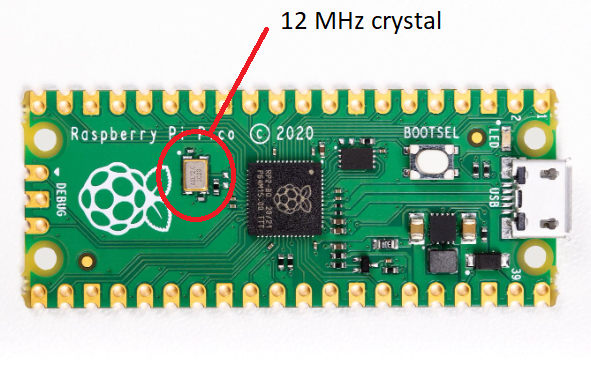

#### Counters

A counter in electronics is a tool that tracks numbers, typically by adding or subtracting one each time the clock ticks. When it reaches its maximum (or minimum) value, it resets or wraps around. This reset is called an "overflow" (when counting up) or "underflow" (when counting down). Some counters can also switch between counting up and down based on control signals.

:::info
A regular counter on 8 bits would count up from 0 to 255, then loop back to 0 and continue counting.
:::

In theory a counter is associated with 3 registers:

| Register | Description |
|-----------|----------|
| `value` | the current value of the counter |
| `direction` | whether the counter is counting UP or DOWN |
| `reset` | if the direction is UP, the value at which the counter resets to 0; if the direction is DOWN, the value at which the counter reset after reaching 0 |

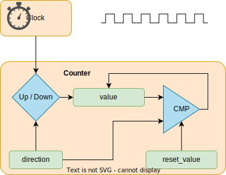

The way the counter works here is that it increments/decrements every clock cycle and checks whether or not it has reached its reset value. If is has, then it resets to its initial value and starts all over again.

#### SysTick

The ARM Cortex-M0 used by RP2040 and the ARM Cortex-M33 used by RP2350 both use the SysTick time counter to keep track of time. This counter is decremented every microsecond, and when it reaches 0, it triggers an exception and then resets.

* `SYST_CVR` register - the value of the timer itself
* `SYST_RVR` register - the reset value
* `SYST_CSR_SET` register:
  * `ENABLE` field - enable/disable the counter
  * `TICKINT` field - enable/disable exception on reaching 0

#### Timers

The simplest way to make a processor wait is to ask the processor to skip a clock cycle a number of times, or by calling the processor instruction `nop` (no operation) in a loop.
:::info
This method is not ideal, since the `nop` instruction stalls the processor and wastes valuable time that could otherwise be used to do other things in the meantime. To optimize this, we can use *alarms*.
:::
An **alarm** is a counter that triggers an interrupt every time it reaches a certain value. This way, an alarm can be set to trigger after a specific interval of time, and while the **alarm** hardware is *running in the background*, the main program can continue executing instructions, and so it is not blocked. When the alarm reaches the chosen value, it goes off and triggers an interrupt that can then be handled in its specific Interrupt Service Routine (ISR).

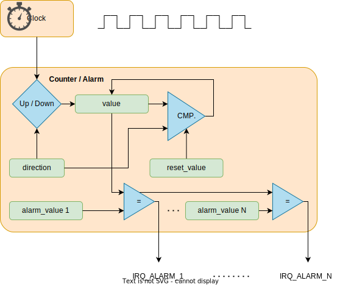

:::info
The **RP2350** timer and the **RP2040's** are fully monotonic, meaning they can never truly overflow. Their value is stored on 64 bits and incremented every 1 microsecond, ensuring precise and consistent timekeeping. This means the last value they can increment to before overflowing is 2<sup>^64-1</sup>, which is equivalent to roughly 500,000 years. RP2040 and RP2350 support 4 different alarms (TIMERx_IRQ_0/1/2/3), which can be used independently, allowing for multiple timed events or tasks to be managed simultaneously.

RP2350 provides two timer peripherals, while RP2040 provides only one.
:::

### Analog and Digital Signals

**Analog signals** are a representation of real-world data. They communicate information in a continuous function of time. They are smooth and time-varying waves, and contain an infinite number of values within the continuous range. An example of an analog signal would be sound, or the human voice.

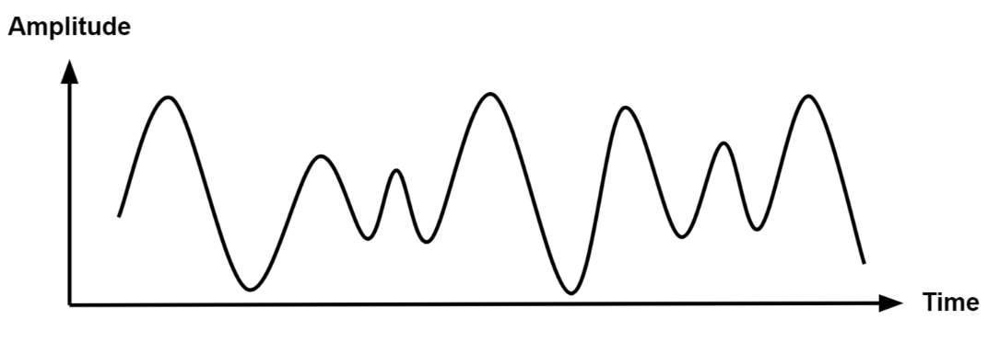

**Digital signals** are a discrete representation of data. They are represented by a sequence of binary values, taken from a finite set of possible numbers. They are square and discrete waves. In most cases, they are represented by two values: 0 and 1 (or 0V and 5V). Digital representation of signals is usually used in hardware.

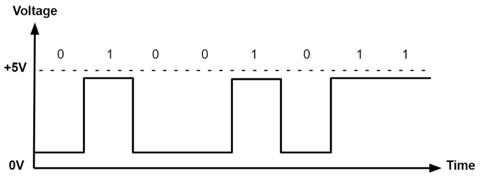

### Pulse-Width Modulation (PWM)

Up to now, we learned to turn an LED on and off, or in other words, set a LED's intensity to 100% or 0%. What if we wanted to turn on the LED only at 50% intensity? We only have a two-level digital value, 0 or 1, so technically a value of 0.5 is not possible. What we can do is simulate this analog signal, so that it *looks* like the LED is at half intensity.

**Pulse-Width Modulation** is a method of simulating an analog signal using a digital one, by varying the width of the generated square wave.

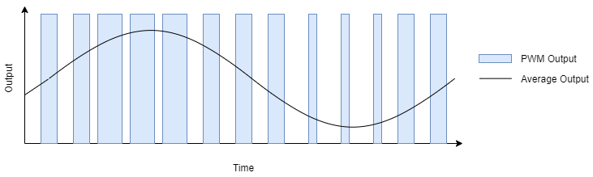

:::note
We can think of the simulated analog signal being directly proportional to the change in digital signal pulse size. The larger the square wave at a given period T, the higher the average analog amplitude output for that period.
:::

The **duty cycle** of the signal is the percentage of time per period that the signal is high.

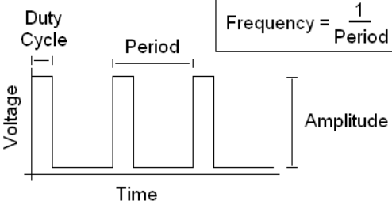

So if we wanted our led to be at 50% intensity, we would choose a duty cycle of 50%. By quickly switching between high and low, the led appears to the human eye as being at only 50% intensity, when in reality, it's only on at max intensity 50% of the time, and off the rest of the time.


$$

duty\_cycle = \frac{time\_on}{period} \%

$$

*Counters* are used by the RP2350 and RP2040 to generate the PWM signals. The PWM counters are controlled by these registers (`X` can be from 0-7, depending on the channel):

* `CHX_CTR` - the actual value of the counter
* `CHX_CC` - the value that the counter will compare to
* `CHX_TOP` - the value at which the counter will reset (or *wrap*)

When `CHX_CTR` is reset, the value of the output signal is 1. The counter counts up until it reaches `CHX_CC`, after which the value of the output signal becomes 0. The counter continues to count until it reaches `CHX_TOP`, and then the signal becomes 1 again. This way, by choosing the value of `CHX_CC`, we set the duty cycle of the PWM signal.

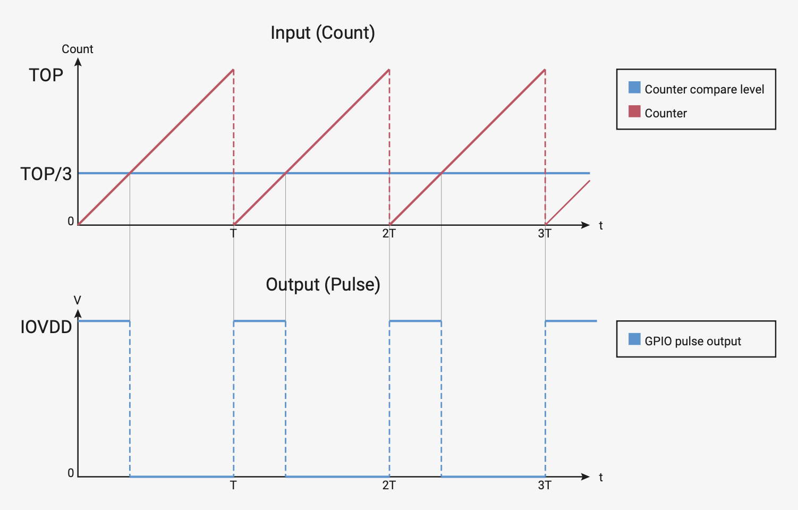

On RP2350 and RP2040, all GPIO pins support PWM. Every two pins share a PWM slice, and each one of them is on a separate channel.

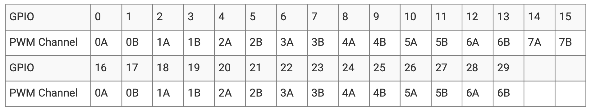

:::info
This means that in order to use a pin as PWM, we need to know what channel it's on, and which output it uses (A or B).
:::

#### Examples of hardware controlled through PWM

* leds
* motors
* buzzers
* RGB leds (what we will be using for this lab)

An **RGB** LED is a led that can emit any color, using a combination of red, green and blue light. On the inside, it's actually made up of 3 separate leds:

* *R* led - to control the intensity of the *red* light
* *G* led - to control the intensity of the *green* light
* *B* led - to control the intensity of the *blue* light

By using PWM on the R, G and B leds, we can control each of their intensity to represent any color.

:::info
For example, if we wanted to create the color purple, we would set the intensity of red and blue to 100%, and the intensity of green to 0%.
:::

There are two different types of RGB LEDs:

* common cathode: all LED cathodes are connected together. A LOW signal means off, and a HIGH signal means on at max intensity.
* common anode: all LED anodes are connected together. A LOW signal means on at max intensity, and a HIGH signal means off.

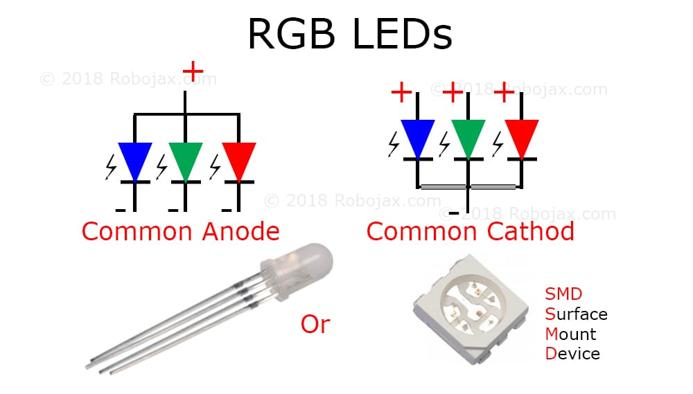

:::warning
For this lab, we will be using **common anode** RGB LEDs, which means that the PWM signal should be *opposite*. 0 will be 100% intensity, and 1 will be 0% intensity.
:::

#### How to wire an RGB LED

The RGB LED that the board provides is signaled with labels `RGB_B` (blue), `RGB_G` (green) and `RGB_R` (red) in the connectors section.

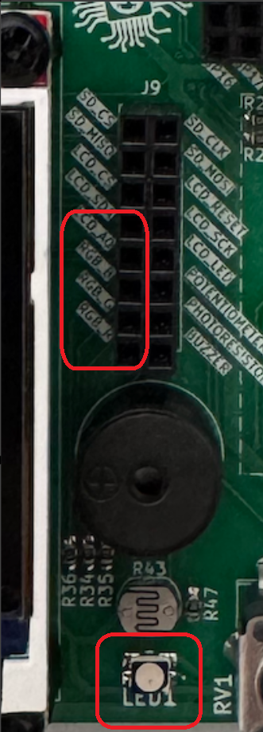

#### How to wire a servo motor

A **servo motor** is a motor that can be controlled with PWM. It has an arm that can be rotated to a specific angle, depending on the PWM signal it receives.

A servo motor has three wires:

* **Power** - usually red, connected to a voltage source (5V)
* **Ground** - usually black, connected to the ground
* **Signal** - usually orange, connected to a PWM pin
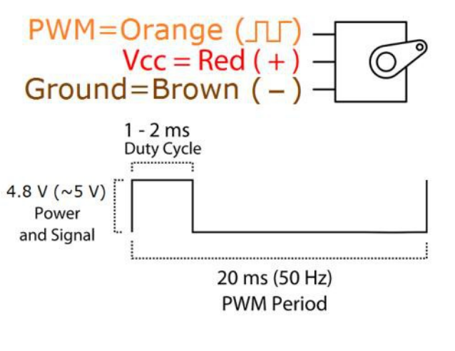

The board provides the connectors for the servo motor. These connectors are labeled `GND`, `PWR`, and `SIG` in the connectors section.

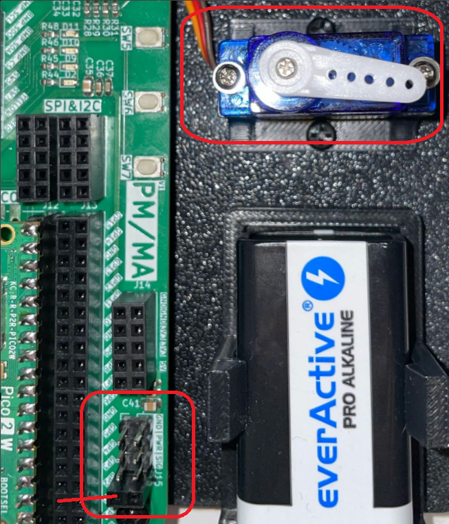

To wire the servo motor to the Raspberry Pi Pico 2, first connect the servo motor to the board using the `GND`, `PWR`, and `SIG` connectors. Then, a jumper wire is needed to connect the `SERVOS` connector on the board to a PWM pin on the Raspberry Pi Pico 2.

#### PWM in Embassy-rs

First, we need a reference to all peripherals, as usual.

```rust
// Initialize peripherals
let peripherals = embassy_rp::init(Default::default());
```

In order to modify the PWM counter configurations, we need to create a `Config` for our PWM.

```rust
// PWM config
use embassy_rp::pwm::Config as ConfigPwm; 

// Create config for PWM slice
let mut config: ConfigPwm = Default::default();
// Set top value (value at which PWM counter will reset)
config.top = 0x9088; // in HEX, equals 37000 in decimal
// Set compare value (counter value at which the 
// PWM signal will change from 1 to 0)
config.compare_a = config.top / 2;
```

In the example above:
    - `top` is the field from `Config` that will define the value at which the counter will reset back to 0
    - `compare_a` is the field from `Config` that will define the value at which the PWM signal will switch from 1 to 0
In this case, `config.compare_a` is half of `config.top`. This means that the duty cycle of the generated PWM signal will be 50%, or, in other words, that the PWM signal will switch from 1 to 0 halfway through each period.

To select the pin that we want to use for PWM, we need to create a new PWM driver that uses the correct channel and output for our pin.

```rust
// Create a PWM driver for pin 3
let mut pwm = Pwm::new_output_b( // Output B
    peripherals.PWM_SLICE1, // Channel 1
    peripherals.PIN_3,   // Pin 3 (modify this as needed)
    config.clone()
);
```

:::warning

1. The code above is an example for pin 3. You need to modify the channel, output and pin depending on the PWM pin you choose to use!
2. The value of `compare_a` or `compare_b` must be changed depending on the desired duty cycle!

:::

If we decide to modify the value of `compare_a` or `compare_b`, we have to update the configuration for the PWM.

```rust
config.compare_b += 100; // modified value of `compare_b`
pwm.set_config(&config); // set the new configuration for PWM
```

#### Controlling a Servo Motor Using PWM

Just like controlling other hardware through PWM, we start by initializing the peripherals:

```rust
// Initialize the RP2350 peripherals
let peripherals = embassy_rp::init(Default::default());
```

To control a servo motor using PWM, we need to calculate the **TOP value**, which determines the PWM period.

#### Calculating the TOP Value

Servos typically expect a **50 Hz** PWM signal, which corresponds to a **20 ms** period.  

$$

top = \left( \frac{f_{clock}}{f_{pwm} \times divider} \right) - 1

$$

For example, with:

$$
\begin{aligned}
f_{clock} &= 150 \,MHz \\
f_{PWM} &= 50 \,Hz \\
divider &= 64
\end{aligned}
$$

We get:

$$
top = \left( \frac{150\,000\,000}{50 \times 64} \right) - 1 = 46\,874
$$

which is `0xB71A` in hexadecimal.

The **clock divider** is used to slow down the high-frequency system clock so that it can generate a usable PWM signal. The RP2350's system clock runs at 150 MHz, which is too fast for direct PWM control of a servo. By setting the divider to 64, we effectively slow down the clock.

Servos interpret PWM signals based on the pulse width rather than just frequency:

* `Period`: The total time for one PWM cycle, which is 20 ms (50 Hz).
* `Minimum Pulse Width`: Typically **0.5 ms**, which corresponds to a servo position of **0 degrees**.
* `Maximum Pulse Width`: Typically **2.5 ms**, which corresponds to a servo position of **180 degrees**.

To convert these pulse widths into PWM compare values, we use:

$$
compare = \left( \frac{pulse_{width} \times top}{T} \right)
$$

where:

* $$pulse_{width}$$ is the desired pulse width in microseconds.
* $$top$$ is the previously calculated counter value (46,874).
* $$T$$ is the total period in microseconds (20,000 μs for 50 Hz).

Now, let's implement this in Rust:

```rust
// Configure PWM for servo control
let mut servo_config: PwmConfig = Default::default();

// Set the calculated TOP value for 50 Hz PWM
servo_config.top = 0xB71A; 

// Set the clock divider to 64
servo_config.divider = 64_i32.to_fixed(); // Clock divider = 64

// Servo timing constants
const PERIOD_US: usize = 20_000; // 20 ms period for 50 Hz
const MIN_PULSE_US: usize = 500; // 0.5 ms pulse for 0 degrees
const MAX_PULSE_US: usize = 2500; // 2.5 ms pulse for 180 degrees

// Calculate the PWM compare values for minimum and maximum pulse widths
let min_pulse = (MIN_PULSE_US * servo_config.top as usize) / PERIOD_US;
let max_pulse = (MAX_PULSE_US * servo_config.top as usize) / PERIOD_US;
```

After setting up the PWM configuration, we want to create a control loop that can dynamically adjust the servo's position.

```rust
// Initialize PWM for servo control
let mut servo = Pwm::new_output_a(
    peripherals.PWM_SLICE1, 
    peripherals.PIN_2, 
    servo_config.clone()
);

// Main loop to move the servo back and forth
loop {
    // Move servo to maximum position (180 degrees)
    // Set compare value for max pulse width
    // Update PWM configuration
    // Wait 1 second
    // Then move the servo to minimum position (0 degrees)
}
```

### Analog-to-Digital Converter (ADC)

Now we know how to represent an analog signal using digital signals. There are plenty of cases in which we need to know how to transform an analog signal into a digital one, for example a temperature reading, or the voice of a person. This means that we need to correctly represent a continuous wave of infinite values to a discrete wave of a finite set of values.
For this, we need to sample the analog signal periodically, in other words to measure the analog signal at a fixed interval of time. This is done by using an **Analog-to-Digital converter**.

The ADC has two important parameters that define the quality of the signal representation:

| Parameter | Description | Impact on quality |
|-----------|-------------|-------------------|
| Sampling Rate | Frequency at which a new sample is read | The higher the sampling rate, the more samples we get, so the more accurate the representation of the signal |
| Resolution | Number of bits which we can use in order to store the value of the sample | The higher the resolution, the more values we can store, so the more accurate the representation |

:::info
For example, a resolution of 8 bits means that we can approximate the analog signal to a value from 0 to 255, where 0 means 0 volts and 255 represents the ADC reference voltage (maximum voltage the ADC can measure).
:::

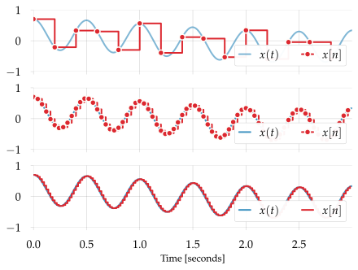

#### Nyquist-Shannon Sampling Theorem

The [Nyquist-Shannon sampling theorem](https://en.wikipedia.org/wiki/Nyquist%E2%80%93Shannon_sampling_theorem) serves as a bridge between continuous-time signals and discrete-time signals. It establishes a link between the frequency range of a signal and the sample rate required to avoid a type of distortion called *aliasing*. Aliasing occurs when a signal is not sampled fast enough to construct an accurate waveform representation.

For an analog signal to be represented without loss of information, the conversion needs to satisfy the following formula:

$$
sampling_f >= 2 \times max_{f}
$$

The analog signal needs to be sampled at a frequency greater than twice the *maximum frequency* of the signal.
In other words, we must sample at least twice per cycle.

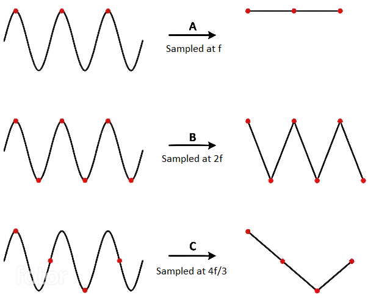

#### Examples of analog sensors

* temperature sensor
* potentiometer
* photoresistor

A **photoresistor** (or photocell) is a sensor that measures the intensity of light around it. Its internal resistance varies depending on the light hitting its surface; therefore, the more light there is, the lower the resistance will be. 

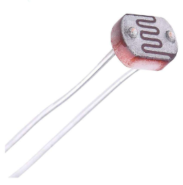

#### How to wire a photoresistor

The photoresistor that the board provides is signaled with the label `PHOTORESISTOR` in the connectors section.

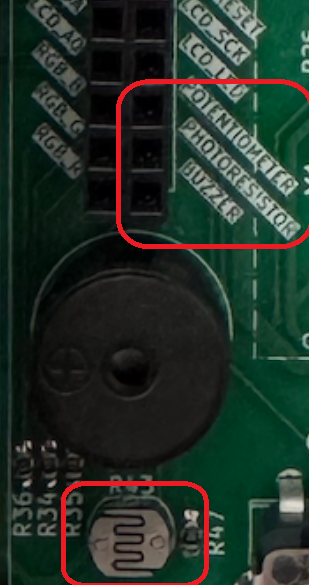

:::info
To wire a photoresistor on your board at home, you need to connect one leg to *GND* and the other leg to a voltage divider.
$$
V_{out} = V_{in} * \frac{R_{2}}{R_{1} + R_{2}};
$$

In our case:

* $ V_{out} $ will be the voltage at the ADC pin on the MCU
* $ V_{in} $ will be the voltage at the GPIO pin the photoresistor is tied to
* $ R_{1} $ is the variable resistance of the photoresistor
* $ R_{2} $ is a resistance compatible with our photoresistor (in our case, 10k $\Omega$)

This way, the ADC pin measures the photoresistor's resistance, without the risk of a short-circuit.

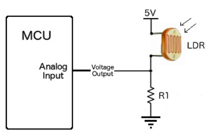
:::

#### ADC in Embassy-rs

On the RP2350, ADC uses an interrupt called `ADC_IRQ_FIFO` to signal whenever a new sample has been added to the ADCs' FIFO. This new sample will be stored inside a FIFO. In the Embassy library, this interrupt is already implemented, so all we need to do is bind it and use it in our ADC variable.

```rust
// Bind the `ADC_IRQ_FIFO` interrupt to the Embassy's ADC handler
bind_interrupts!(struct Irqs {
    ADC_IRQ_FIFO => InterruptHandler;
});

// ---- fn main() ----

// Initialize peripherals
let peripherals = embassy_rp::init(Default::default());

// Create ADC driver
let mut adc = Adc::new(peripherals.ADC, Irqs, Config::default());
```

:::warning
If we are using PWM and ADC in the same code, we will have two different `Config` imports with the same name. In order to avoid compilation errors, we need to separate the PWM config import from the ADC one. To do this, we can import the two `Config`s with different names.

```rust
use embassy_rp::adc::Config as ConfigAdc; // ADC config

// ---- fn main() ----
let mut adc = Adc::new(peripherals.ADC, Irqs, ConfigAdc::default());
```

:::

Now, we need to initialize the ADC pin we will be using. The Raspberry Pi Pico has 3 pins that support ADC: `ADC0`, `ADC1`, and `ADC2`.

```rust
// Initialize ADC pin
// X should be replaced with a pin number
let mut adc_pin = Channel::new_pin(peripherals.PIN_X, Pull::None); 
```

Once we have the ADC and pin set up, we can start reading values from the pin. 

```rust
loop {
    // read a value from the pin
    let level = adc.read(&mut adc_pin).await.unwrap(); 

    // print the value over serial
    info!("Light sensor reading: {}", level); 

    // wait a bit before reading and printing another value
    Timer::after_secs(1).await; 
}
```

### Inter-Integrated Circuit (I2C)

The Inter-Integrated Circuit (I2C) is a synchronous, multi-controller/multi-target communication protocol. Similarly to the SPI, it allows data transfer between a controller and one or more peripheral ICs, but it uses only 2 wires (1 data line and 1 clock line, making it half-duplex) and has a different way of addressing the peripherals: using the their unique *addresses*.

#### Configuration


I2C transmission uses 2 lines:

* **SCL** - **S**erial **CL**ock line - clock is generated by the controller - used to synchronize communication between the controller and the targets
* **SDA** - **S**erial **DA**ta line - carries data between the controller and the addressed target
  * targets read data from SDA **only** when the clock is *low*
  * targets write data to SDA **only** when the clock is *high*

:::info
The communication is *half-duplex*. This means that data is transmitted only in one direction at a time, since there is only *one* data line that can be used both for sending data to the target and receiving data from the target.
:::

:::info
The `SDA` and `SCL` wires are never actually driven (set to `LOW`/`HIGH`) by the controller/peripherals. The line is controlled by either pulling the line low or releasing the line high.

When the line is *pulled down*, this means that it is tied directly to `GND`. This electronically translates to `LOW`.

When the line is *released*, or *pulled up*, this means that it ties back to `3V3` (which we can consider as being the "default" state of the wire) through a pull-up resistor. This electronically translates to `HIGH`.

This is called *open-drain connection*. You can read more about how it works [here](https://www.ti.com/lit/an/sbaa565/sbaa565.pdf?ts=1712891793335#:~:text=I2C%20is%20a%20two%2Dwire,and%20receive%20commands%20and%20data.), at section 2.2.
:::

#### Data transmission

Each target is associated with a unique *address*. The controller uses this address to initiate communication with that target. This address can either be 7 or 10 bits.

##### Initiation

Before the transmission, both the `SCL` and `SDA` lines are set to `HIGH`. First thing the controller does is to signal a `start` condition by pulling the `SDA` line to `LOW`. All targets understand that the communication is about to commence and listen on the `SDA` line. Next, the controller starts the clock and begins to write the address of the target it wants to talk to, followed by a command bit that signifies whether the controller wants to *read* from the target or *write* to it. Whichever target recognizes its address, responds with an `ACK` (acknowledged), by pulling the `SDA` to `LOW`. If no target responds and the `SDA` stays `HIGH`, then it is considered a `NACK` (not acknowledged). Afterwards, the data transmission can begin.

##### Transmission

Depending on the command bit (R/W), either the controller or the target begins to send data over the `SDA` line. Data is sent one byte at a time, and then acknowledged by the receiver. One sequence of a data byte and `ack` is called a *frame*.

During the communication, data can be:

* written to the `SDA` line *only* when `SCL` is `LOW` or
* read from the `SDA` line *only* when `SCL` is `HIGH`.

##### End

To end the transmission, the controller signals a `stop` condition. This is done by releasing the `SCL` line to `HIGH`, and then also releasing the `SDA` line. Since data can be written *only* when `SCL` is `LOW`, the target understands that this is a special event, that means that the communication has ended.

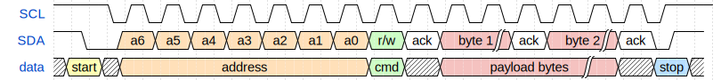

:::note
For 10-bit addresses, the controller first issues a specific sequence of bits. This sequence is reserved, therefore targets with 7-bit addresses are prohibited from having addresses that start with this sequence. These bits mark the fact that the controller is attempting to initiate communication with a target with a 10-bit address, so all 7-bit targets ignore the `SDA` line once they recognize this sequence. After the special sequence, the controller sends the upper 2 bits of the address, then waits for an `ack` from the target(s) that have an address that begins with these 2 bits. Afterwards, it sends the rest of the address, and waits for an acknowledgement from the target.

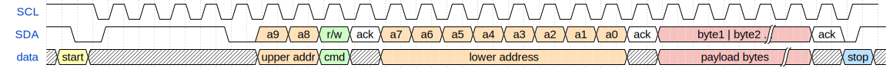
:::

#### I2C in Embassy

These are the I2C imports we will be using. We will use the functions provided by the `embedded_hal` crate, since these are standard and used by most frameworks.

```rust
use embassy_rp::i2c::{I2c, InterruptHandler as I2CInterruptHandler, Config as I2cConfig};
use embedded_hal_async::i2c::{Error, I2c as _};
use embassy_rp::peripherals::I2C0;
```

:::info
The reason why we use `I2c as _` from `embedded_hal_async` is that in order to use the `embedded_hal` trait methods, the trait needs to be imported.
:::

We start by initializing the peripherals.

```rust
let peripherals = embassy_rp::init(Default::default());
```

Next, we declare the pins we will be using for the SDA and SCL lines. We can find which pins of the Raspberry Pi Pico have these functions by looking at the pinout.

```rust
let sda = peripherals.PIN_X;
let scl = peripherals.PIN_Y;
```

We then initialize our I2C instance, using the pins we defined earlier and a default configuration. It's recommended to use the asynchronous version, since it won't block the executor.

```rust
let mut i2c = I2c::new_async(peripherals.I2C0, scl, sda, Irqs, I2cConfig::default());
```

The first argument of the `new` function is the I2C channel that will be used. There are two I2C channels on the Raspberry Pi Pico, and depending on which pins we decided to use, we can see which channel they are on by looking at the pinout.

The `Irqs` variable refers to the interrupt that the I2C driver will use when handling transfers. We also need to bind this interrupt, which depends on the I2C channel we are working with.

```rust
bind_interrupts!(struct Irqs {
    I2C0_IRQ => I2CInterruptHandler<I2C0>;
});
```

:::warning
Since multiple `Config`s and `InterruptHandler`s can exist in one file, in the code examples above, `I2cConfig` and `I2CInterruptHandler` are renamed imports:

```rust
use embassy_rp::i2c::{I2c, InterruptHandler as I2CInterruptHandler, Config as I2cConfig};
```

:::

#### Reading from a target

To read from a target, we will be using the `read_async` function of the I2C driver.

The function takes 2 parameters:

* the address of the target we are attempting to receive the data from
* the *receiving* buffer in which we will store the data received from the target

The following example reads two bytes from the target of address `0x44`.

```rust
const TARGET_ADDR: u16 = 0x44;
let mut rx_buf = [0x00u8; 2];
i2c.read(TARGET_ADDR, &mut rx_buf).await.unwrap();
```

#### Writing to a target

To write data to a target, we will be using the `write_async` function of the I2C driver.

This function also takes 2 parameters:

* the address of the target we are attempting to transmit the data to
* the *transmitting* buffer that contains the data we want to send to the target

The following example writes two bytes to the target of address `0x44`.

```rust
const TARGET_ADDR: u16 = 0x44;
let tx_buf = [0x01, 0x05];
i2c.write(TARGET_ADDR, &tx_buf).await.unwrap();
```

:::info

We can also use `write_read` if we want to perform both a write and a read one after the other.

```rust
i2c.write_read(TARGET_ADDR, &tx_buf, &mut rx_buf).await.unwrap();
```

:::

## Tasks

:::danger Important
As this is an embedded workshop, you will need to make several connections using the provided male-to-male wires. **Do not power the board** without asking an assistant if it is ok to do so.
:::

Before you start with writing code, make sure you register your team in this [spreadsheet](https://docs.google.com/spreadsheets/d/1wVNxWiOeCw_OBxBlQvEoAUpePjKxQL9dRNmtNhi3-aE/edit?usp=sharing).

A skeleton application, which periodically blinks an external LED, connected to the `GP4` pin can be found in this [repository](https://github.com/UPB-RustWorkshop-Students/embassy-mar-2025). It should already include everything you will need for today's workshop, in regards of external dependencies. Go ahead and clone it locally. In order to run it, you will need to actually connect the LED to the specified pin, using one of the provided male-to-male cables. For the LED, you can use any of the exposed LED's labeled `RED`, `GREEN`, `BLUE` and `YELLOW`. Then you can run the following command:

```shell
cargo run --bin demo
```

:::danger Important
Throughout this section, you will find multiple `HINT`s, please try to solve the tasks yourself. The hints should be there as a last resort, after you have spent a few minutes being **stuck**, and are not supposed to be a shortcut in order to speedrun the workshop. Keep in mind that you can only solve a task once, and once read, a hint cannot be unread.
:::

### Hi, I am new here!

For your first task, you will need to print your team's name in terminal using the [defmt](https://crates.io/crates/defmt) whenever you press any of the four buttons labeled `SW4`, `SW5`, `SW6` and `SW7`.

#### Baby steps

You should begin by printing something in terminal. Take a look at the [defmt book](https://defmt.ferrous-systems.com).

[`HINT`](./hints.md#hi-i-am-new-here---hint-01)

#### Use the button

Try to incorporate one button into your application. You will need to `await` a button press, and then print the message in a continuous loop. Check the Embassy's [`Input`](https://docs.embassy.dev/embassy-rp/git/rp235xb/gpio/struct.Input.html) documentation. Try to use one of the asynchronous functions, as it will be easier to extend it. Make sure you don't forget to wire the button.

[`HINT`](./hints.md#hi-i-am-new-here---hint-02)

#### Now let's use 'em all

You can combine multiple futures using the `select` and `join` functions exposed by the [`embassy-futures`](https://docs.embassy.dev/embassy-futures/git/default/index.html) crate.

[`HINT`](./hints.md#hi-i-am-new-here---hint-03)

### Sing your own tune!

This task requires singing one song of your desire, using the **active buzzer** located on the board.

#### Configure the PWM

You will need to a PWM output pin. In order to do that, you will need to decide what pin to use, and figure out what PWM Channel it is using. In order to do that, you will need to consult the [datasheet](https://datasheets.raspberrypi.com/rp2350/rp2350-datasheet.pdf). The Embassy's PWM api can be consulted [here](https://docs.embassy.dev/embassy-rp/git/rp235xb/pwm/index.html).

[`HINT`](./hints.md#sing-your-own-tune---hint-01)

#### A crumb of music theory?

In music, note duration can be

* whole note - lasts 4 beats
* half note - lasts 2 beats
* quarte note - lasts one beat
* eight note - lasts half a beat
* sixteenth note - last a quarter of a beat

Notes can also be *dotted*, which means that its duration is increased by half of its initial "play time". (e.g a dotted half note, which would usually last 2 beats will last 3 beats).

We already have implemented the `Note` enum for you, which you can find in the `src/music.rs` module. It has variants for every standard piano note, and the value of each variant is the frequency of the respective note.

#### A bunch of constants

Next, we will need to define the duration of a **whole note**. To do that, we will need to determine the **tempo**. The tempo differs from song to song, and it is measured in beats per minute. For now, we will use a **100 BPM tempo**. Based on this, a whole note duration should be **4 x beat_duration_ms = 4 * (60_000 ms / TEMPO)**.

The microcontroller runs at `150 MHz`. This frequency is quite high, and that will be a problem when trying to match a note frequency using a `64` divider to slow it down. You will need to do so using the PWM `Config`.

#### Playing one octave

Our representation of one song will be an array of tuples:

```rust
const SONG: [(Option<Note>, i8); LEN] = {
    (Some(Note::A0), 8),
    (Some(Note::B2), 4),
    (None, 1),
    ...
}
```

A song is composed of either notes or pauses, which is why we chose to use the `Option` enum, and we chose to represent its length as fractions of the whole note (meaning that a `(None, 4)` represents a pause of a quarter of a note and a `(Some(Note::A2), 2)` is a half note A2). We omitted the dotted notes, and to represent them, we will use the negative counterparts of the notes. Therefore, `(Some(Note::C2), -2)` will be treated as a dotted C2 half note.

In the `music.rs` module, you will find already defined an 8 note array that represents an octave. You will need to connect the buzzer to a pin, that you will configure as PWM output. Then, you need to iterate over the array and figure out the duration of the note based on the above mentioned convention and "play" it, by configuring the `top` register to generate a signal of matching the note's frequency, and a **duty cycle of 50%**. In order to mimic a real instrument, for the last 10% of the note duration we will turn off the buzzer.

Even though there are no *pause* notes, handling them now will help you later.

[`HINT`](./hints.md#sing-your-own-tune---hint-03)

#### Finally, some good music

Pick a song and try to play it. You can find some examples already implemented in C, using the same conventions [here](https://github.com/robsoncouto/arduino-songs/tree/master).

### My own thermometer!

For this task, you need to implement a *basic* thermometer, that will read the ambient pressure and communicate it using the RGB LED. It will display a color ranging from **blue** to **red**, depending how close the temperature's value is to the minimum threshold (20°C) and the maximum threshold (35°C).

RGB LEDs are made of 3 separate LEDs (one for each color channel) that are controlled individually. They come in two different configurations:


The one on the board is a **common anode**, and because of that the LEDs are off when the signal is high, and are at maximum intensity when the signal is low. Keep that in mind when writing your code, and for a clearer picture, consult the [schematics](https://gitlab.cs.pub.ro/pmrust/pm-ma-pcb).

#### Disco party

Start by making the LED fade from blue to red. Remember what you learned at the previous exercise about configuring a PWM channel and **do not forget to wire the LED** using the sockets labeled `RGB_R`, `RGB_G` and `RGB_B`.

[`HINT`](./hints.md#the-temperature-is-rising---hint-01)

#### The temperature is rising

To read the temperature, we wil use the **BMP280** temperature and pressure sensor. You can find its datasheet [here](https://www.bosch-sensortec.com/media/boschsensortec/downloads/datasheets/bst-bmp280-ds001.pdf), and we highly encourage you to open it. The interaction with the sensor will be handled by the `bmp280` module. You will need to explore it a bit, in order to figure out what is it's api. The module exposes two submodules, `i2c` and `spi`, depending on the underlying communication protocol you want to use. For this workshop, we will use **I2C**, because it only requires you to connect the `BMP_SCL` and `BMP_SDA` to two I2C capable pins. The fastest way to determine two pins like so is to check the Raspberry Pi Pico 2 W [pinout](https://datasheets.raspberrypi.com/picow/pico-2-w-pinout.pdf).

Instantiate the `I2C` bus providing the two pins `SCA` and `SDL` and the respective peripheral (`I2C0` or `I2C1`) and a default config. Then instantiate the `BMP280` and set the control options, (power mode and pressure and temperature oversampling rate). You will also need to bind the interrupt for the I2C peripheral (`I2CX_IRQ`, where `X` is the peripheral number), using the `bind_interrupt!` macro. You can find an example in its [documentation](https://docs.embassy.dev/embassy-rp/git/rp235xb/macro.bind_interrupts.html).

[`HINT`](./hints.md#the-temperature-is-rising---hint-02)

#### The last step

Now, combine the two into a solution.

### Smile and Wave!

For your last challenge, you will need to use the joystick, to *wave* the servo motor's arm. What you need to know, is that the joystick has 2 potentiometers *"under the hood"*, one for each axis. You will need to configure the two ADC channels to read the joystick position, and use PWM to control the servomotor.

:::danger Joystick wiring
Ignore the fact that label shows an input voltage of 5V, and use the **3V3** to power it. Otherwise, you risk damaging the board.
:::

For this task, you are on your own... Feel free to use the [Documentation](./index.md#documentation) provided by us, the materials on Embassy available on the internet, including their official Github, or other repos. The only thing you get is this last [`HINT`](https://www.youtube.com/watch?v=dQw4w9WgXcQ).
